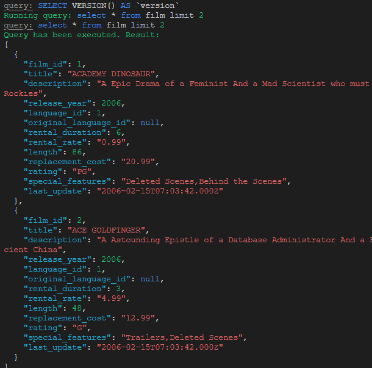

<div align="right">

### ⚡ RMM ⚡

</div>

# Node CLI TypeORM

Auxilia na criação e manutenção de migrations usando TypeORM. 

Também pode ser útil para os estudos com TS + Banco de dados.

## Configuração

Instalar dependências...

```bash
$ npm i
```

..ajuste as credenciais de acesso ao banco no arquivo`config/data-source`.

## Docker <small>(opcional)</small>

Para testar este CLI utilizei 
https://github.com/ricardo-melo-martins/docker
, tem instruções para "subir" os dumps do sakila com poucos comandos

## Comandos

### db:query

Comando para interagir com o banco de dados.

```bash
$ npm run db:query "select * from film limit 2"

```

Exemplo de saída



### migrate:create

Deve criar um arquivo de migração para subir uma alteração no banco de dados

Defina um nome e substitua `name` no comando a seguir

Para a migraçao e é necessário fornecer o path `migrations`

```bash
$ npm run migrate:create migrations/<name>
```

reference: https://typeorm.io/migrations#creating-a-new-migration


### migrate:run ou migrate

Deve processar a migração criada e as pendentes diretamente no banco de dados

```bash
$ npm run migrate:run
```

No arquivo `config/data-source` esta definido o path de migração

reference: https://typeorm.io/migrations#running-and-reverting-migrations


### migrate:generate

Deve gerar uma migraçao a partir de uma alteraçao no banco

```bash
$ npm run migrate:generate <nome>
```

reference: https://typeorm.io/migrations#generating-migrations

### migrate:revert

Desfaz migraçoes

```bash
$ npm run migrate:revert <nome>
```

reference: https://typeorm.io/migrations#running-and-reverting-migrations


### migrate:generate

Gerar um migration após criar um entity

```bash
$ npm run migrate:generate ./migrations/User

```

